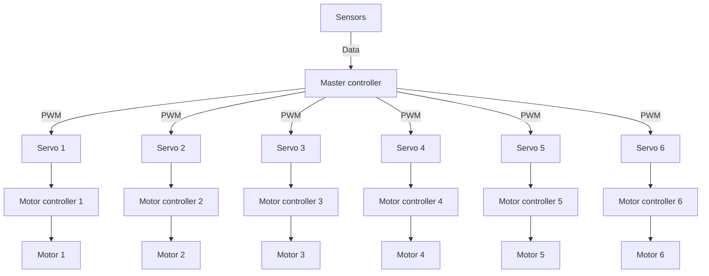

<h1>Motor drive system</h1>

<h2>Requirements</h2>
<h3>Functional requirements</h3>
<ol>
    <li>Drive motor using API endpoints</li>
    <li>API endpoints must regulate speed, direction, angular of motor</li>
    <li>Communicate with motor controller (optional)</li>
</ol>
<h3>Non-functional requirements</h3>
<ol>
    <li>Motor controller commercial ready solution</li>
    <li>Servos controller commercial ready solution</li>
    <li>Motor controller costs < 100$</li>
    <li>Motor controller support PWM, data communication (optional)</li>
    <li>Servos also support PWM and data communication (optional)</li>
    <li><a href="https://www.amazon.com/Cytron-30A-Motor-Driver-MD30C/dp/B07L6HGFWY">Link to product</a></li>
</ol>

<h2>Architecture design</h2>

Architecture design is relationship between functional components affected by non-functional requirenements that describe how our system is organized. First step is identidy functional components that we used

<h3>Architecture diagramm</h3>

<h3>API design</h3>

API defines how computer systems interact with each other. In our case computer systems are Master controller and Motor controller

