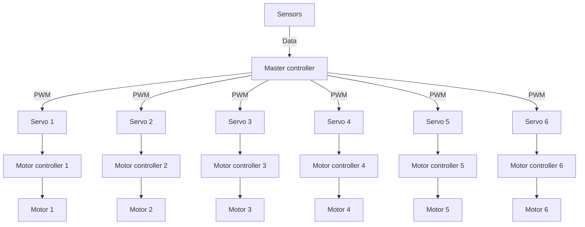

<h1>Motor drive system</h1>

<h2>Requirements</h2>
<h3>Functional requirements</h3>
<ol>
    <li>Drive motor using API endpoints of Raspberry PI</li>
    <li>API endpoints must regulate speed, direction, angular of motor</li>
    <li>Communicate with motor controller (optional)</li>
</ol>
<h3>Non-functional requirements</h3>

Non-functional requirements are constraints on services of system. We use different type of physical modeling to choose components for our budgets. Here some resources to modeling our rover.

    Also, we need use some physical metrics of rover:
    <ol>
        <li>Max weight of rover < 75kg</li>
        <li>Radius of wheel 25cm</li>
    </ol>

<ol>
    <li><a href="https://www.cytron.io/tutorial/choosing-dc-motor">Choose of DC motors</a></li>
    <li><a href="https://web.archive.org/web/20230108014816/https://community.robotshop.com/blog/show/drive-motor-sizing-tool">Calculation of torque</a></li>
    <li><a href="https://racheldebarros.com/arduino-projects/guide-to-choosing-the-best-dc-motor-drivers-for-arduino/">Choose of DC controller</a></li>
</ol>

<ol>
    <li>Motor controller and servos commercial ready solution</li>
    <li>Motor controller and servos support PWM, data communication (optional)</li>
    <li><a href="https://www.amazon.com/Cytron-30A-Motor-Driver-MD30C/dp/B07L6HGFWY">Link to motor controller</a></li>
    <li><a href="https://www.amazon.com/37GB550-gear-motor-torque-reduction/dp/B0DJ53DMZX?th=1">Link to motor</a></li>
</ol>

<h2>Architecture design</h2>

Architecture design is relationship between functional components affected by non-functional requirenements that describe how our system is organized. First step is identidy functional components that we used

<h3>Architecture diagramm</h3>

<h3>API design</h3>

API defines how computer systems interact with each other. In our case computer systems are Master controller and Motor controller

